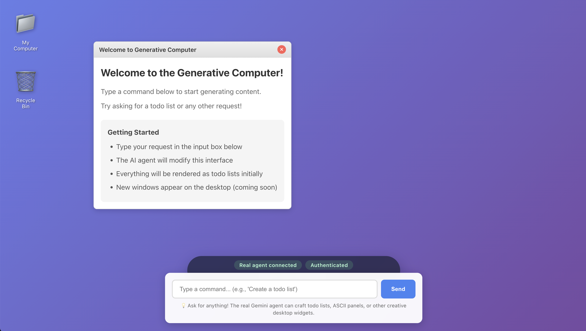

# Generative Computer



Generative Computer is an interactive desktop inspired by Claude Imagine and built on top of Gemini CLI. You can talk to the computer to generate any content you want.

This is a proof of concept which will be iterated quickly as the project develops.

## How It Works

1. You type a request in the computer (rendered in the browser).
2. The backend forwards the request—and strict guardrails—to the Gemini CLI bundle.
3. Gemini edits `GeneratedContent.tsx` (and only that file).
4. Vite hot-reloads, so the desktop windows morph in real time.

## System Requirements

- Node.js 20 or newer
- npm 9+
- Gemini CLI credentials on the machine (OAuth login, API key, or Vertex AI)

## First-Time Setup

Clone and boot the desktop:

```bash
git clone https://github.com/joshbickett/generative-computer
cd generative-computer
./computer
```

The helper installs dependencies, builds the Gemini CLI bundle, checks authentication, and launches both backend and frontend. If cached credentials are missing, it guides you through login before continuing. Future runs are the same—just type `./computer` from the repo root.

Prefer a global command? Run `npm link` (or symlink `computer` somewhere on your `$PATH`) to start the Generative Computer from any directory with a plain `computer`.

## Run the Full Experience

```bash
./computer
```

The orchestrator will:

- Double-check Gemini authentication (and reopen `npm start` if credentials are missing)
- Install dependencies for the repo, backend, and frontend when `node_modules/` folders are absent
- Build the Gemini CLI bundle if `bundle/gemini.js` is missing
- Start the backend on `http://localhost:3001` with `USE_REAL_AGENT=true`
- Start the Vite dev server on `http://localhost:5173`

Press `Ctrl+C` to shut everything down.

### Helpful Environment Flags

- `DEBUG_AGENT=true ./computer` — surface Gemini stdout/stderr and write transcripts to `logs/agent/`

## Project Structure

```
generative-computer/
├── frontend/
│   ├── src/components/
│   │   ├── CommandInput.tsx    # Always-on prompt box (protected from edits)
│   │   ├── Desktop.tsx         # Desktop layout and window manager
│   │   ├── Window.tsx          # Draggable window wrapper
│   │   └── GeneratedContent.tsx # File Gemini rewrites on every command
│   └── package.json
├── backend/
│   ├── server.js               # Express API (POST /api/command)
│   ├── gemini-agent.js         # Spawns the Gemini CLI bundle with guardrails
│   └── smart-simulator.js      # Deterministic fallback content generator
├── bundle/                     # Output of `npm run build` (gemini.js lives here)
├── start.sh                    # Launch script for auth + both services
└── logs/agent/                 # Populated when DEBUG_AGENT=true
```

## Troubleshooting

- **Missing bundle** – run `npm run build` if `bundle/gemini.js` is absent before calling `./computer` (or `npm start`).
- **Authentication loop** – rerun `npm start` and choose “Login with Google” (or your preferred auth mode) to refresh credentials.
- **Ports 3001/5173 busy** – stop conflicting processes; `./computer` attempts to free both ports automatically.
- **Node version warnings** – switch to Node 20 (`nvm use 20`, `fnm use 20`, etc.) to avoid runtime issues.

Enjoy building on the generative desktop! ✨
