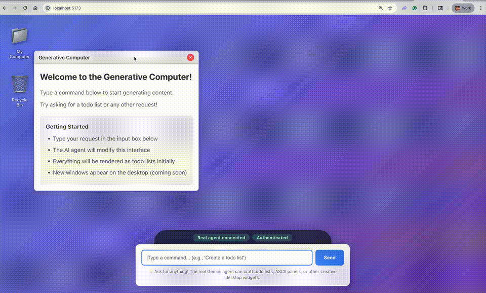

# Generative Computer



Generative Computer is an interactive desktop inspired by Claude Imagine and built on top of Gemini CLI. You can talk to the computer to generate any content you want.

This is a proof of concept which will be iterated quickly as the project develops.

## How It Works

A generative computer runs an AI agent on the backend that generates code to render what the user requests in real time.

1. You type a request in the computer (rendered in the browser).
2. The backend forwards the request to the Gemini agent.
3. Gemini edits `GeneratedContent.tsx` (and only that file right now).
4. Vite hot-reloads, so the desktop windows morph in real time.

## Gemini CLI Highlights

Upstream Gemini CLI powers this project; notable capabilities include:

- **🎯 Free tier**: 60 requests/min and 1,000 requests/day with personal Google account.
- **🧠 Powerful Gemini 2.5 Pro**: Access to 1M token context window.
- **🔧 Built-in tools**: Google Search grounding, file operations, shell commands, web fetching.
- **🔌 Extensible**: MCP (Model Context Protocol) support for custom integrations.
- **💻 Terminal-first**: Designed for developers who live in the command line.
- **🛡️ Open source**: Apache 2.0 licensed.

## System Requirements

- Node.js 20 or newer
- npm 9+
- Gemini CLI credentials on the machine (OAuth login, API key, or Vertex AI)

## First-Time Setup

Clone and boot the desktop:

```bash
git clone https://github.com/joshbickett/generative-computer
cd generative-computer
./computer
```

The helper installs dependencies, builds the Gemini CLI bundle, checks authentication, and launches both backend and frontend. If cached credentials are missing, it guides you through login before continuing. Future runs are the same—just type `./computer` from the repo root.

Prefer a global command? Run `npm link` (or symlink `computer` somewhere on your `$PATH`) to start the Generative Computer from any directory with a plain `computer`.

## Run the Full Experience

```bash
./computer
```

The orchestrator will:

- Double-check Gemini authentication (and reopen `npm start` if credentials are missing)
- Install dependencies for the repo, backend, and frontend when `node_modules/` folders are absent
- Build the Gemini CLI bundle if `bundle/gemini.js` is missing
- Start the backend on `http://localhost:3001` with `USE_REAL_AGENT=true`
- Start the Vite dev server on `http://localhost:5173`

Press `Ctrl+C` to shut everything down.

### Helpful Environment Flags

- `DEBUG_AGENT=true ./computer` — surface Gemini stdout/stderr and write transcripts to `logs/agent/`

## Project Structure

```
generative-computer/
├── generative-computer/
│   ├── AGENTS.md               # Overview of the agent stack and workflows
│   ├── frontend/
│   │   ├── src/components/
│   │   │   ├── CommandInput.tsx    # Always-on prompt box (protected from edits)
│   │   │   ├── Desktop.tsx         # Desktop layout and window manager
│   │   │   ├── Window.tsx          # Draggable window wrapper
│   │   │   └── GeneratedContent.tsx # File Gemini rewrites on every command
│   │   └── package.json
│   └── backend/
│       ├── server.js               # Express API (POST /api/command)
│       ├── gemini-agent.js         # Spawns the Gemini CLI bundle with guardrails
│       └── smart-simulator.js      # Deterministic fallback content generator
├── bundle/                     # Output of `npm run build` (gemini.js lives here)
├── computer                    # Thin wrapper that forwards to start.sh
├── start.sh                    # Launch script for auth + both services
└── logs/agent/                 # Populated when DEBUG_AGENT=true
```

The nested `./generative-computer/` folder keeps the frontend and backend agents grouped together so the top-level `./computer` launcher can keep its original name.

## Stay In The Loop

🚀 **Follow me on Twitter for updates on the project:** [Follow me on Twitter](https://x.com/intent/follow?screen_name=josh_bickett)

## Troubleshooting

- **Missing bundle** – run `npm run build` if `bundle/gemini.js` is absent before calling `./computer` (or `npm start`).
- **Authentication loop** – rerun `npm start` and choose “Login with Google” (or your preferred auth mode) to refresh credentials.
- **Ports 3001/5173 busy** – stop conflicting processes; `./computer` attempts to free both ports automatically.
- **Node version warnings** – switch to Node 20 (`nvm use 20`, `fnm use 20`, etc.) to avoid runtime issues.

Enjoy building on the generative desktop! ✨

The sections below summarize the latest upstream Gemini CLI information for reference.

## Gemini CLI Release Channels

See [Releases](./docs/releases.md) for more details.

### Preview

New preview releases will be published each week at UTC 2359 on Tuesdays. These releases will not have been fully vetted and may contain regressions or other outstanding issues. Please help us test and install with `preview` tag.

```bash
npm install -g @google/gemini-cli@preview
```

### Stable

- New stable releases will be published each week at UTC 2000 on Tuesdays, this will be the full promotion of last week's `preview` release + any bug fixes and validations. Use `latest` tag.

```bash
npm install -g @google/gemini-cli@latest
```

### Nightly

- New releases will be published each week at UTC 0000 each day, This will be all changes from the main branch as represented at time of release. It should be assumed there are pending validations and issues. Use `nightly` tag.

```bash
npm install -g @google/gemini-cli@nightly
```

## 📋 Gemini CLI Key Features

### Code Understanding & Generation

- Query and edit large codebases
- Generate new apps from PDFs, images, or sketches using multimodal capabilities
- Debug issues and troubleshoot with natural language

### Automation & Integration

- Automate operational tasks like querying pull requests or handling complex rebases
- Use MCP servers to connect new capabilities, including [media generation with Imagen, Veo or Lyria](https://github.com/GoogleCloudPlatform/vertex-ai-creative-studio/tree/main/experiments/mcp-genmedia)
- Run non-interactively in scripts for workflow automation

### Advanced Capabilities

- Ground your queries with built-in [Google Search](https://ai.google.dev/gemini-api/docs/grounding) for real-time information
- Conversation checkpointing to save and resume complex sessions
- Custom context files (GEMINI.md) to tailor behavior for your projects

### GitHub Integration

Integrate Gemini CLI directly into your GitHub workflows with [**Gemini CLI GitHub Action**](https://github.com/google-github-actions/run-gemini-cli):

- **Pull Request Reviews**: Automated code review with contextual feedback and suggestions
- **Issue Triage**: Automated labeling and prioritization of GitHub issues based on content analysis
- **On-demand Assistance**: Mention `@gemini-cli` in issues and pull requests for help with debugging, explanations, or task delegation
- **Custom Workflows**: Build automated, scheduled and on-demand workflows tailored to your team's needs

## 🔐 Gemini CLI Authentication Options

Choose the authentication method that best fits your needs:

### Option 1: Login with Google (OAuth login using your Google Account)

**✨ Best for:** Individual developers as well as anyone who has a Gemini Code Assist License. (see [quota limits and terms of service](https://cloud.google.com/gemini/docs/quotas) for details)

**Benefits:**

- **Free tier**: 60 requests/min and 1,000 requests/day
- **Gemini 2.5 Pro** with 1M token context window
- **No API key management** - just sign in with your Google account
- **Automatic updates** to latest models

#### Start Gemini CLI, then choose _Login with Google_ and follow the browser authentication flow when prompted

```bash
gemini
```

#### If you are using a paid Code Assist License from your organization, remember to set the Google Cloud Project

```bash
# Set your Google Cloud Project
export GOOGLE_CLOUD_PROJECT="YOUR_PROJECT_ID"
gemini
```

### Option 2: Gemini API Key

**✨ Best for:** Developers who need specific model control or paid tier access

**Benefits:**

- **Free tier**: 100 requests/day with Gemini 2.5 Pro
- **Model selection**: Choose specific Gemini models
- **Usage-based billing**: Upgrade for higher limits when needed

```bash
# Get your key from https://aistudio.google.com/apikey
export GEMINI_API_KEY="YOUR_API_KEY"
gemini
```

### Option 3: Vertex AI

**✨ Best for:** Enterprise teams and production workloads

**Benefits:**

- **Enterprise features**: Advanced security and compliance
- **Scalable**: Higher rate limits with billing account
- **Integration**: Works with existing Google Cloud infrastructure

```bash
# Get your key from Google Cloud Console
export GOOGLE_API_KEY="YOUR_API_KEY"
export GOOGLE_GENAI_USE_VERTEXAI=true
gemini
```

For Google Workspace accounts and other authentication methods, see the [authentication guide](./docs/get-started/authentication.md).

## 🚀 Gemini CLI Getting Started

### Basic Usage

#### Start in current directory

```bash
gemini
```

#### Include multiple directories

```bash
gemini --include-directories ../lib,../docs
```

#### Use specific model

```bash
gemini -m gemini-2.5-flash
```

#### Non-interactive mode for scripts

Get a simple text response:

```bash
gemini -p "Explain the architecture of this codebase"
```

For more advanced scripting, including how to parse JSON and handle errors, use the `--output-format json` flag to get structured output:

```bash
gemini -p "Explain the architecture of this codebase" --output-format json
```

### Quick Examples

#### Start a new project

```bash
cd new-project/
gemini
> Write me a Discord bot that answers questions using a FAQ.md file I will provide
```

#### Analyze existing code

```bash
git clone https://github.com/google-gemini/gemini-cli
cd gemini-cli
gemini
> Give me a summary of all of the changes that went in yesterday
```

## 📚 Gemini CLI Documentation

### Getting Started

- [**Quickstart Guide**](./docs/get-started/index.md) - Get up and running quickly.
- [**Authentication Setup**](./docs/get-started/authentication.md) - Detailed auth configuration.
- [**Configuration Guide**](./docs/get-started/configuration.md) - Settings and customization.
- [**Keyboard Shortcuts**](./docs/cli/keyboard-shortcuts.md) - Productivity tips.

### Core Features

- [**Commands Reference**](./docs/cli/commands.md) - All slash commands (`/help`, `/chat`, etc).
- [**Custom Commands**](./docs/cli/custom-commands.md) - Create your own reusable commands.
- [**Context Files (GEMINI.md)**](./docs/cli/gemini-md.md) - Provide persistent context to Gemini CLI.
- [**Checkpointing**](./docs/cli/checkpointing.md) - Save and resume conversations.
- [**Token Caching**](./docs/cli/token-caching.md) - Optimize token usage.

### Tools & Extensions

- [**Built-in Tools Overview**](./docs/tools/index.md)
  - [File System Operations](./docs/tools/file-system.md)
  - [Shell Commands](./docs/tools/shell.md)
  - [Web Fetch & Search](./docs/tools/web-fetch.md)
- [**MCP Server Integration**](./docs/tools/mcp-server.md) - Extend with custom tools.
- [**Custom Extensions**](./docs/extensions/index.md) - Build and share your own commands.

### Advanced Topics

- [**Headless Mode (Scripting)**](./docs/cli/headless.md) - Use Gemini CLI in automated workflows.
- [**Architecture Overview**](./docs/architecture.md) - How Gemini CLI works.
- [**IDE Integration**](./docs/ide-integration/index.md) - VS Code companion.
- [**Sandboxing & Security**](./docs/cli/sandbox.md) - Safe execution environments.
- [**Trusted Folders**](./docs/cli/trusted-folders.md) - Control execution policies by folder.
- [**Enterprise Guide**](./docs/cli/enterprise.md) - Deploy and manage in a corporate environment.
- [**Telemetry & Monitoring**](./docs/cli/telemetry.md) - Usage tracking.
- [**Tools API Development**](./docs/core/tools-api.md) - Create custom tools.

### Troubleshooting & Support

- [**Troubleshooting Guide**](./docs/troubleshooting.md) - Common issues and solutions.
- [**FAQ**](./docs/faq.md) - Frequently asked questions.
- Use `/bug` command to report issues directly from the CLI.

### Using MCP Servers

Configure MCP servers in `~/.gemini/settings.json` to extend Gemini CLI with custom tools:

```text
> @github List my open pull requests
> @slack Send a summary of today's commits to #dev channel
> @database Run a query to find inactive users
```

See the [MCP Server Integration guide](./docs/tools/mcp-server.md) for setup instructions.

## 🤝 Contributing to Gemini CLI

Gemini CLI is fully open source (Apache 2.0), and the community is encouraged to:

- Report bugs and suggest features.
- Improve documentation.
- Submit code improvements.
- Share MCP servers and extensions.

See the upstream [Contributing Guide](./CONTRIBUTING.md) for development setup, coding standards, and how to submit pull requests.

Check the [Official Roadmap](https://github.com/orgs/google-gemini/projects/11) for planned features and priorities.

## 📖 Gemini CLI Resources

- **[Official Roadmap](./ROADMAP.md)** - See what's coming next.
- **[Changelog](./docs/changelogs/index.md)** - See recent notable updates.
- **[NPM Package](https://www.npmjs.com/package/@google/gemini-cli)** - Package registry.
- **[GitHub Issues](https://github.com/google-gemini/gemini-cli/issues)** - Report bugs or request features.
- **[Security Advisories](https://github.com/google-gemini/gemini-cli/security/advisories)** - Security updates.

### Uninstall

See the [Uninstall Guide](docs/cli/uninstall.md) for removal instructions.

## 📄 Gemini CLI Legal

- **License**: [Apache License 2.0](LICENSE)
- **Terms of Service**: [Terms & Privacy](./docs/tos-privacy.md)
- **Security**: [Security Policy](SECURITY.md)

---

<p align="center">
  Built with ❤️ by Google and the open source community
</p>
